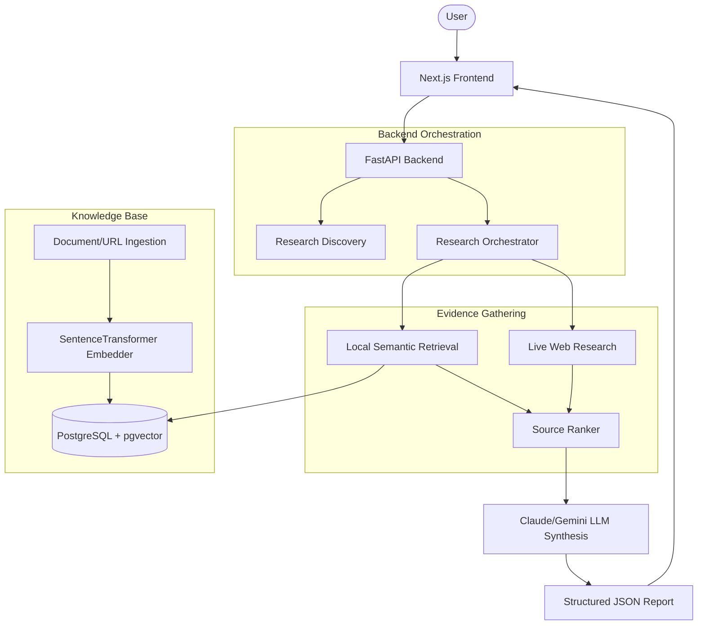

# Research Intelligence Workspace

> **An experimental, end-to-end AI research system that decomposes complex questions, gathers grounded evidence, and synthesizes structured findings.**

The Research Intelligence Workspace is more than just a "RAG chatbot." It is a multi-step research agent designed to demonstrate how modern AI systems can ingest documents, search the web, evaluate evidence, and construct highly grounded, structured research briefs.

This project serves as both a functional research application and an open-source learning resource for building complex, robust LLM applications.

---

## 🎯 What Makes This Different?

Most basic LLM chatbots take a user query, perform a single vector search, and dump the results into a prompt. This system takes a fundamentally different, rigorous approach:

1. **Query Decomposition**: A main research topic is automatically broken down into 3-5 focused sub-questions.
2. **Multi-Faceted Retrieval**: Each sub-question triggers its own independent retrieval against your local vector database and (optionally) live web searches.
3. **Source Ranking**: Evidence from diverse sources is aggressively ranked and filtered via semantic cosine distance before it ever reaches the LLM.
4. **Strict Evidence Grounding**: The LLM is forced to cite its sources and explicitly flag when there is **Insufficient Evidence** rather than hallucinating an answer.
5. **Structured Outputs**: The final result is not a block of text, but a strict JSON-structured report containing individual findings and a synthesized overall summary.

---

## 🚀 Core Features

- **Document Ingestion**: Upload PDFs or scrape URLs to extract text.
- **Page-Aware Chunking**: Intelligently segments documents while preserving source metadata and page numbers.
- **Semantic Vector Search**: Powered by `all-MiniLM-L6-v2` Sentence Transformers and stored in PostgreSQL with `pgvector`.
- **Web Research Integration**: Optionally supplements local documents with live web scraping via DuckDuckGo and Wikipedia.
- **Grounded Research Reports**: Explicit handling of unsupported claims ("Insufficient Evidence").
- **LLM Orchestration**: Built-in support for Anthropic Claude (default) and Google Gemini.
- **Production-Ready**: Dockerized backend, Next.js frontend, and Railway-compatible deployment.

---

## 🏗️ System Architecture

At a high level, the system separates the heavy lifting of document ingestion from the fast path of retrieval and synthesis.



> **Deep Dive**: Check out [docs/architecture.md](docs/architecture.md) for a detailed breakdown of the internal pipelines and data flow.

---

## 💻 Tech Stack

| Component | Technology | Purpose |
| --- | --- | --- |
| **Frontend** | Next.js 16, React, Tailwind CSS | UI, streaming responses, and research workspace rendering. |
| **Backend** | Python, FastAPI | High-performance, asynchronous API routing. |
| **Database** | PostgreSQL + `pgvector` | Relational persistence combined with vector similarity search. |
| **Embeddings** | `sentence-transformers` (`all-MiniLM-L6-v2`) | Local, CPU-optimized semantic embedding generation (384 dimensions). |
| **LLMs** | Anthropic Claude (`claude-3-5-sonnet`) | High-quality reasoning, question decomposition, and synthesis. |
| **Deployment** | Docker, Docker Compose, Railway | Containerization and cloud-native hosting. |

---

## 🛠️ Getting Started

### Prerequisites

- Git
- Python 3.10+
- Node.js 18+
- Docker & Docker Compose
- API Keys (Anthropic or Google Gemini)

### 1. Clone the Repository
```bash
git clone https://github.com/your-username/research-intelligence-workspace.git
cd research-intelligence-workspace
```

### 2. Environment Setup
Copy the example environment file and fill in your details:
```bash
cp .env.example .env
```
Ensure you provide at least one LLM API key (e.g., `ANTHROPIC_API_KEY`).

### 3. Start the Database
The project uses Docker to quickly spin up PostgreSQL with the `pgvector` extension.
```bash
docker compose up -d db
```

### 4. Run the Backend
```bash
# Set up Python virtual environment
python -m venv .venv
source .venv/bin/activate  # On Windows: .venv\Scripts\activate
pip install -r requirements.txt

# Start the FastAPI server
uvicorn backend.main:app --reload --port 8001
```

### 5. Run the Frontend
In a new terminal window:
```bash
cd frontend
npm install
npm run dev
```
Navigate to `http://localhost:3000` to start researching!

---

## 📚 Documentation

The repository is fully documented to help you understand, extend, and deploy the system.

- [**System Architecture & Pipelines**](docs/architecture.md) — Detailed breakdown of ingestion, retrieval, and synthesis.
- [**API Reference**](docs/api.md) — Available FastAPI endpoints and JSON schemas.
- [**Deployment Guide**](docs/deployment.md) — How to deploy using Docker and Railway.

---

## 🧪 Evaluation & Verification

This project includes a strict deterministic validation suite to ensure that backend contracts, schemas, and processing logic remain intact without burning paid LLM credits.

To run the 48-check validation suite:
```bash
python experiments/validate_system.py
```
This tests chunking, vector operations, source ranking sorting, caching, and frontend API contracts.

---

## 🎓 Learning Outcomes

If you are exploring this codebase to learn about AI engineering, pay special attention to:
- **`backend/services/source_ranker.py`**: Demonstrates batched vector embeddings for extreme performance gains.
- **`backend/services/research_service.py`**: Shows how to construct bounded retries for malformed LLM JSON outputs without hallucinating data.
- **`backend/services/context_builder.py`**: Demonstrates strict provenance tracking, ensuring every piece of text sent to the LLM retains a reference back to its exact page number or URL.

---

## 🛡️ Security Notes

- **Never commit `.env`**.
- Keep production secrets safely stored in your hosting provider's environment configuration (e.g., Railway).
- The Next.js frontend strictly communicates with the backend; it never handles API keys directly.

---

## 🗺️ Roadmap

**Currently Implemented:**
- End-to-end local document RAG.
- Live web research fallback and merging.
- Explicit `insufficient_evidence` flagging.
- Dockerized Postgres infrastructure.

**Planned / Future:**
- *Stronger Source Management*: Ability to selectively toggle individual documents on/off per query.
- *Background Research Jobs*: For asynchronous, deeply recursive web research tasks.
- *Authentication*: Multi-tenant user workspaces.

---

## 📄 License

This project is licensed under the MIT License. See the [LICENSE](LICENSE) file for details.
